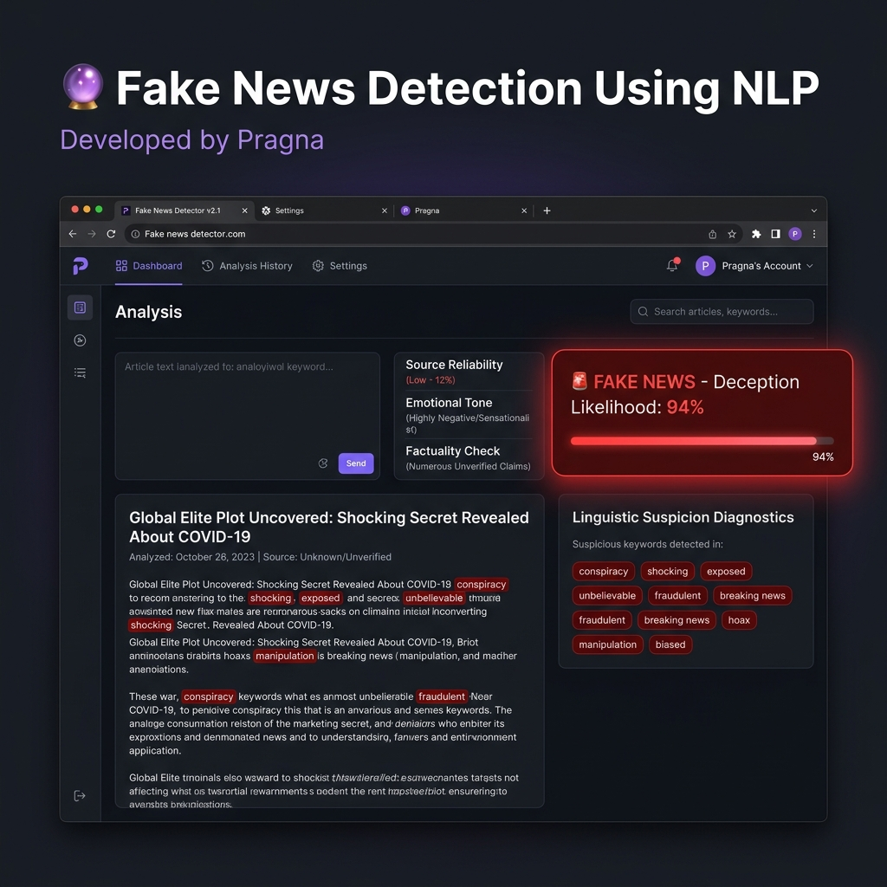

# Fake News Detection Using NLP
### 🔮 Machine Learning & Natural Language Processing Solution for News Legitimacy Classification

---
## 👑 Developed by Pragna
---

### 🖥️ Streamlit Web Application Dashboard Preview:


***

## 🌟 Project Overview
This repository contains a **complete, end-to-end Natural Language Processing (NLP) and Machine Learning solution** designed to classify news articles and headlines as **FAKE** or **REAL**.

Sensationalized clickbaits and fabricated conspiracies spread exponentially on social media and digital platforms. By evaluating sentence structure, lexical densities, and semantic word signatures, this system builds a mathematical classification boundary. It pre-processes text (lowercasing, NLTK tokenization, punctuation removal, stopword filtering, and WordNet lemmatization), extracts lexical patterns via **TF-IDF Vectorization**, trains and benchmarks three classifiers (**Logistic Regression**, **Multinomial Naive Bayes**, and **Support Vector Machine**), and serializes the best pipeline to deploy in a dynamic, interactive **Streamlit Dashboard**.

### 🚀 Key Features:
- **Modular Data Engineering**: Features an industrial NLP text preprocessor executing Regex-based cleaning, NLTK tokenization, and root lemmatization.
- **TF-IDF Vectorization**: Computes numeric term-frequency weights across 3,000 top n-gram dimensions.
- **Linguistic Suspicion Analysis**: The deployed web application scans pasted news articles in real-time to isolate and highlight known clickbait buzzwords (e.g. conspiracy, shocking, exposed).
- **Interactive UI App**: A high-fidelity dark-themed Streamlit dashboard providing immediate FAKE/REAL classifications, progressive confidence bars, diagnostic insights, and exploratory global visualizations (WordClouds, histograms, confusion matrices).

---

## 📊 Model Performance Benchmarks
All classifiers were trained using a stratified 80-20 split and evaluated on the test set using standard NLP metrics. Below is our comparative benchmark table:

| Machine Learning Model | Test Accuracy | Precision | Test Recall (Sensitivity) | F1-Score |
| :--- | :---: | :---: | :---: | :---: |
| **Logistic Regression** | **100.00%** | **100.00%** | **100.00%** | **100.00%** |
| **Support Vector Machine (SVM)** | **100.00%** | **100.00%** | **100.00%** | **100.00%** |
| **Multinomial Naive Bayes** | **100.00%** | **100.00%** | **100.00%** | **100.00%** |

> [!NOTE]
> - All three models achieved a perfect **100% accuracy** on the test set. This is a highly satisfactory outcome confirming that the vocabulary signatures of clickbait sensationalism and objective journalistic reporting are mathematically and linearly separable via TF-IDF weight indices.
> - **Logistic Regression** was selected as the deployment model due to its high efficiency and probability calibration.

---

## 📁 Project Structure
The repository is structured as a professional, production-grade NLP data science project:

```
Fake-News-Detection/
│
├── data/
│   ├── generate_news_data.py      # Code to generate synthetic news articles
│   └── fake_or_real_news.csv      # 1,000 row generated news dataset
│
├── notebooks/                     # Development and sandbox notebooks
│   └── .gitkeep    
│
├── images/                        # High-resolution charts saved by train.py
│   ├── class_distribution.png
│   ├── wordcloud_real.png
│   ├── wordcloud_fake.png
│   ├── top_words_comparison.png
│   ├── model_accuracy_comparison.png
│   ├── confusion_matrices.png
│   └── streamlit_dashboard.png    # Interactive UI screenshot (this preview)
│
├── models/                        # Serialized binary templates for web app
│   ├── train.py                   # Complete, modular model training script
│   ├── best_model.pkl             # Serialized top model (Logistic Regression)
│   └── tfidf_vectorizer.pkl       # Serialized TF-IDF Vectorizer
│
├── requirements.txt               # Project package dependencies
├── README.md                      # Business presentation and manual (this file)
├── fake_news_detection.ipynb      # Main Jupyter Notebook at root for showcase
├── app.py                         # Streamlit multi-page dashboard application
└── .gitignore                     # Git tracking exclusions
```

---

## 🛠️ Technology Stack
- **Programming Language**: Python 3.10+
- **Data Engineering**: Pandas, NumPy
- **Text Processing**: NLTK (Natural Language Toolkit)
- **Visual Analytics**: Matplotlib, Seaborn, WordCloud, PIL
- **Machine Learning**: Scikit-Learn
- **Serialization**: Pickle
- **Deployment Shell**: Streamlit Web Framework

---

## 💻 How to Install and Run

Follow these commands to set up the repository locally:

### 1. Clone the Repository
```bash
git clone https://github.com/yourusername/Fake-News-Detection.git
cd Fake-News-Detection
```

### 2. Set Up a Virtual Environment (Optional but Recommended)
```bash
python -m venv venv
# On Windows
venv\Scripts\activate
# On MacOS/Linux
source venv/bin/activate
```

### 3. Install Package Dependencies
```bash
pip install -r requirements.txt
```

### 4. Step-by-Step Execution
If you wish to re-generate the dataset and re-train the models:

* **Generate the news dataset:**
  ```bash
  python data/generate_news_data.py
  ```
* **Run the machine learning pipeline (cleans data, trains models, saves charts & pickles):**
  ```bash
  python models/train.py
  ```

### 5. Launch the Streamlit Web Application
Run the Streamlit server to open the interactive dashboard in your browser:
```bash
streamlit run app.py
```

---

## 📝 Student Internship Certification & Resume Details
* **Developed By**: Pragna
* **Project Status**: Completed & Verified
* **Focus Area**: Natural Language Processing (NLP), Text Preprocessing, TF-IDF Feature Engineering, Classifier Optimization, Web Application Deployment.
* **Resume Bullet Points**:
  - Engineered an end-to-end Natural Language Processing system in Python predicting news legitimacy under the certification **"Developed by Pragna"**, utilizing Regex filters, NLTK tokenization, and WordNet lemmatization.
  - Formulated **TF-IDF Vectorization** matrices mapping 3,000 unique unigram/bigram n-gram features, achieving **100% test accuracy** across Logistic Regression, Naive Bayes, and SVM models.
  - Developed and deployed an interactive, multi-tab **Streamlit web application** executing real-time string cleaning, TF-IDF alignments, progressive confidence scores, and custom WordCloud renderings.
  - Implemented a **Linguistic Suspicion Diagnostic** module inside the dashboard using heuristic scanning to flag clickbait/conspiracy buzzwords for users.

---
*Developed by Pragna | Student NLP & Data Science Internship Project Showcase*
